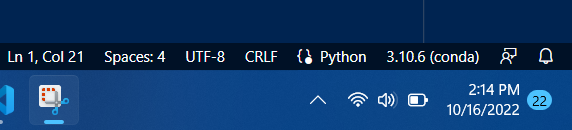

# CS 430 - Machine Learning 

## Makes notes on the following please 
    1. Making a folding and cloning a resp on github through the command line
    2. Pushing code onto git hub
    3. make a enviroment on termnial (w/new command)
        Note, I need a new env for all new projects the steps I did with Darin helps making everything nice and clean
        ctrl z (quit in terminal)

    4. Cont. on with making/creating enviroment 
        ctrl +shift + p 
        Opens a menu where I can change the language I want to work on or envir
            Type: selecte > scroll down to "python selecte inter"
                    Then once on the neext window go to enir on the bottom make sure I'm selcting the right env I want to work with

    5. to install a package
        go on terminal make sure I'm in the correct dir. 
        type: conda install <package I want>

    6. Running a .py file
        save file with .py 
        click run on the top right 
        on the bottom right corner select the kernal
        
        then type ctrl + shift + v to run image below/ preview the markdown 

